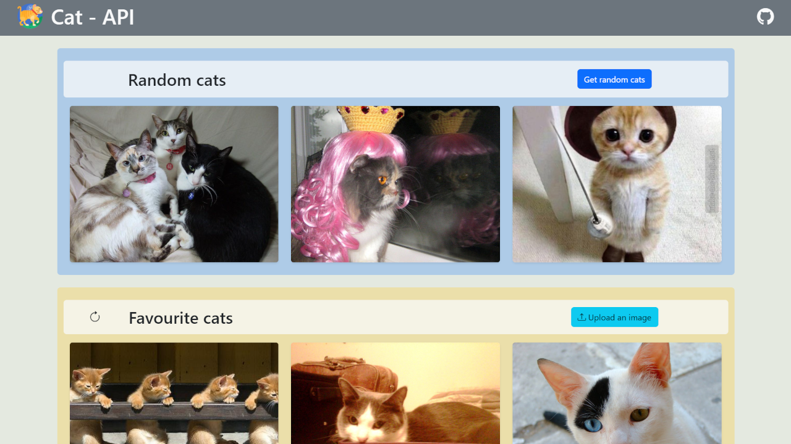
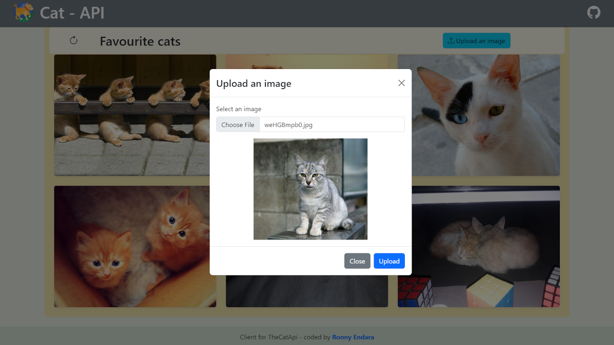
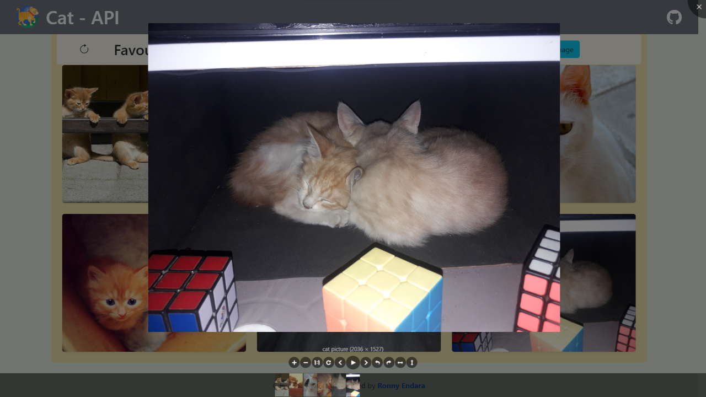

# Cat API
This is a client app that uses theCatApi.

## Index
- [Description](#description)
- [Built with](#build-with)
- [Links](#links)
- [Screenshots](#screenshots)
- [Project Setup](#project-setup)
- [Author](#author)

## Description
This project consists in a client app that consumes the 'theCatApi' REST-API, includes the following features:

- Get random cat images
- Save, list and remove favourites
- Upload a specific file image
- Image viewer

## Built with
- Semantic HTML5 markup
- [Bootstrap 5](https://getbootstrap.com/) - Frontend Toolkit
- [Viewer.js](https://fengyuanchen.github.io/viewerjs/) - JavaScript image viewer
- [Parcel](https://parceljs.org/) - Bundler
- [theCatApi](https://thecatapi.com/) - REST API

## Links
- Live site URL: [Cat Api live site](https://rojaence.github.io/cat-api)

## Screenshots

### Upload image with modal window

### Image viewer


## Project Setup

```sh
npm install
```

### Compile for Development
```sh
npm run dev
```

### Compile for Production
```sh
npm run build
```

### Api-key
If you have your own api-key, replace in 'api.js'
```js
const API_URL = "https://api.thecatapi.com/v1";
const API_KEY = "your api-key";
```

## Author
- Frontend Mentor - [@rojaence](https://www.frontendmentor.io/profile/rojaence)
- Twitter - [@EndaraRonny](https://www.twitter.com/EndaraRonny)
- LinkedIn - [Ronny Endara](https://www.linkedin.com/in/ronny-endara)
- Platzi - [Profile](https://platzi.com/p/rojaence/)


